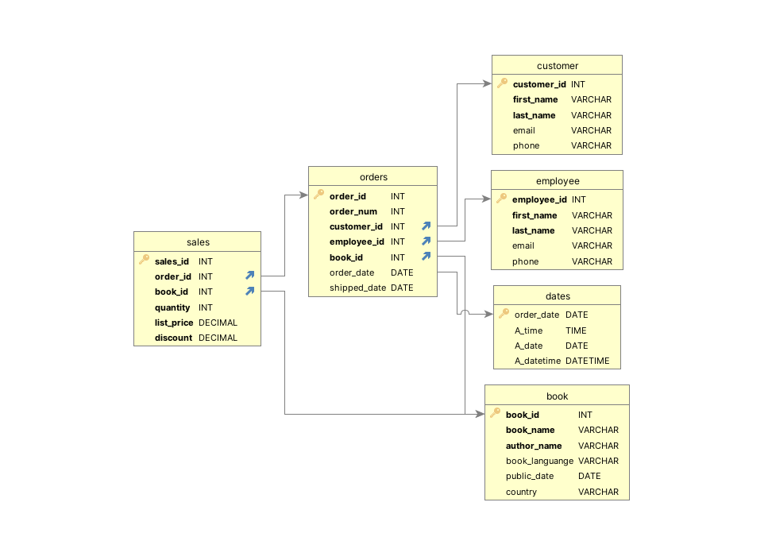
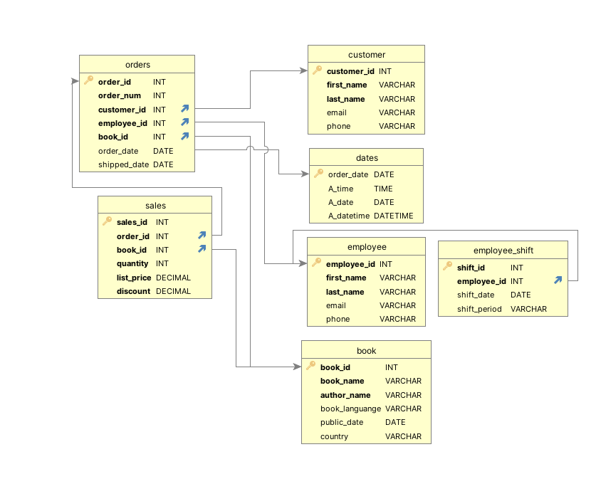

# Assignment 1: Design a Logical Model

## Question 1
Create a logical model for a small bookstore. 📚

At the minimum it should have employee, order, sales, customer, and book entities (tables). Determine sensible column and table design based on what you know about these concepts. Keep it simple, but work out sensible relationships to keep tables reasonably sized. Include a date table. There are several tools online you can use, I'd recommend [_Draw.io_](https://www.drawio.com/) or [_LucidChart_](https://www.lucidchart.com/pages/).

-  

## Question 2
We want to create employee shifts, splitting up the day into morning and evening. Add this to the ERD.





## Question 3
The store wants to keep customer addresses. Propose two architectures for the CUSTOMER_ADDRESS table, one that will retain changes, and another that will overwrite. Which is type 1, which is type 2?

[03_bookstore_model_Q3.png](./images/03_bookstore_model_Q3.png)

_Hint, search type 1 vs type 2 slowly changing dimensions._

Bonus: Are there privacy implications to this, why or why not?
```
In Type 1, you overwrite the data in the dimensions. There may be cases where you don't have all the data when the record is initialized to size. For example, you may not receive all features when customer registration is initiated. Therefore, when the customer record is started in the operational database, there will be empty or empty records in the customer records.
It can be useful to have a chart that reflects only the current state, but there are times when it is appropriate or even necessary to track historical changes for a dimension. With SCD type 2, historical data is preserved by adding a new row whenever a dimension changes and designating this new row as valid accordingly, while also specifying the new historical record accordingly.
```

## Question 4
Review the AdventureWorks Schema [here](https://i.stack.imgur.com/LMu4W.gif)

Highlight at least two differences between it and your ERD. Would you change anything in yours?
```
First of all, AdventureWorks 2008 has very detailed information and contains the information of a large company.
We can see how large an organization can be and how tables containing information such as Production, People, Sales and Purchasing can be designed under subheadings. It is a very good example to see the tables in various fields and their relationships with each other.
It has more details than a small bookstore model I prepared. They have organized the scheme, which I designed as a single table, into at least 5-6 subheadings.
For example, in the design I made for the employee table, there is a name, surname, e-mail address, and phone number. However, in the personnel table they designed, there are sub-tables under a single main table for all this information.

Would you change anything in yours?

To be realistic, I think the diagram I prepared for a small bookstore is sufficient. But as my sales increase and the number of my customers increases, I will need subtables and a detailed database for each of my main tables.


```

# Criteria

[Assignment Rubric](./assignment_rubric.md)

# Submission Information

🚨 **Please review our [Assignment Submission Guide](https://github.com/UofT-DSI/onboarding/blob/main/onboarding_documents/submissions.md)** 🚨 for detailed instructions on how to format, branch, and submit your work. Following these guidelines is crucial for your submissions to be evaluated correctly.

### Submission Parameters:
* Submission Due Date: `June 1, 2024`
* The branch name for your repo should be: `model-design`
* What to submit for this assignment:
    * This markdown (design_a_logical_model.md) should be populated.
    * Two Entity-Relationship Diagrams (preferably in a pdf, jpeg, png format).
* What the pull request link should look like for this assignment: `https://github.com/<your_github_username>/sql/pull/<pr_id>`
    * Open a private window in your browser. Copy and paste the link to your pull request into the address bar. Make sure you can see your pull request properly. This helps the technical facilitator and learning support staff review your submission easily.

Checklist:
- [ ] Create a branch called `model-design`.
- [ ] Ensure that the repository is public.
- [ ] Review [the PR description guidelines](https://github.com/UofT-DSI/onboarding/blob/main/onboarding_documents/submissions.md#guidelines-for-pull-request-descriptions) and adhere to them.
- [ ] Verify that the link is accessible in a private browser window.

If you encounter any difficulties or have questions, please don't hesitate to reach out to our team via our Slack at `#cohort-3-help`. Our Technical Facilitators and Learning Support staff are here to help you navigate any challenges.
